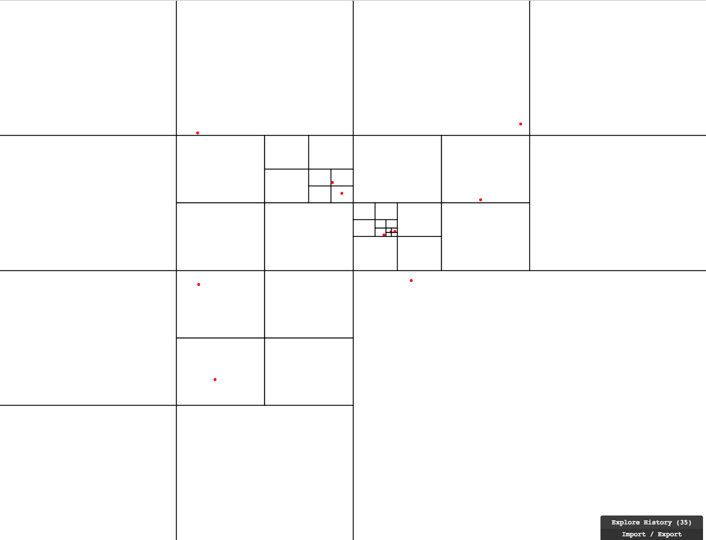

# Quadtrees

A purely-functional pragmatic way to express quadtrees in elm. 

## Getting started

You need to have [Elm](http://elm-lang.org/) 0.18 installed on your machine.

Compile this project with:

    elm make demo/`<someFile>`.elm

Then view it:

    elm reactor
